# Enterprise content platform "Vmeste"
**Задача от HR Sber:** создать инструмент для публикации контента и общения на внутрикорпоративной платформе Сбера.

Команда HR Sber занимается созданием и поддержкой различных сервисов для сотрудников. Одним из направлений является раздел «Развитие», в котором собран образовательный и другой полезный контент. «Развитие» состоит из каталога и ленты, которая подкидывает пользователю релевантный контента из каталога. Каталог наполняется из нескольких источников – образовательные курсы, публикации технических и новостных порталов, книги онлайн-библиотеки, материалы экспертов Банка и СберУниверситета, YouTube и другое.  

В рамках работы на хакатоне необходимо придумать и реализовать инструмент для самостоятельного создания и размещения сотрудниками контента и своей экспертизы на платформе (в каталоге/ленте), а также системы обмена этим контентом с другими пользователями.  

Данный проект разрабатывался в рамках онлайн-хакатона 2021 "SberCode": https://sbercode.tech.

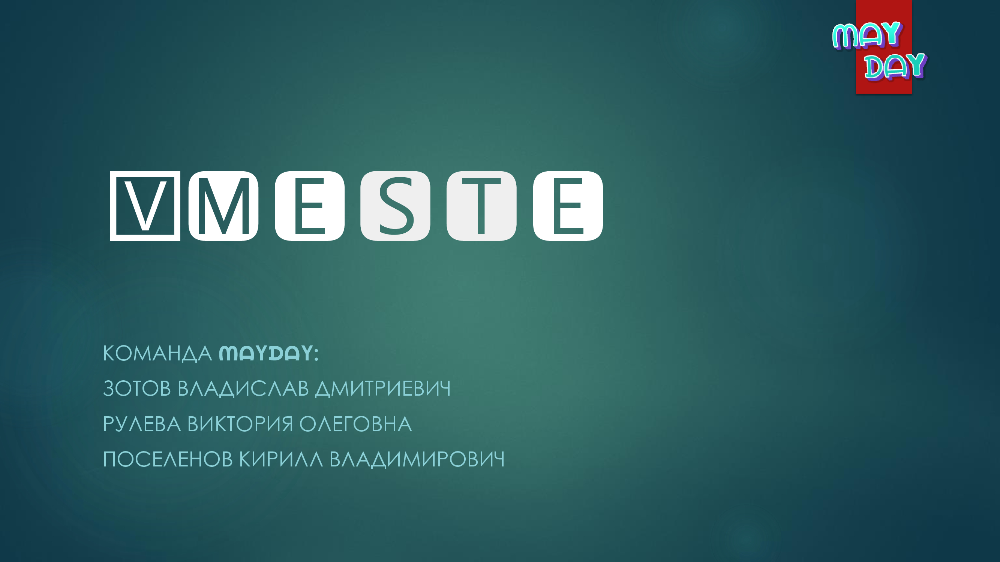
##
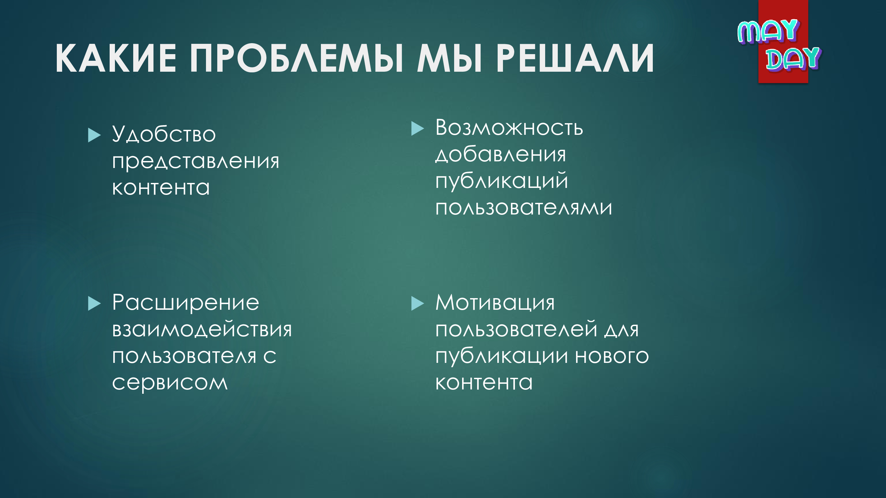
##
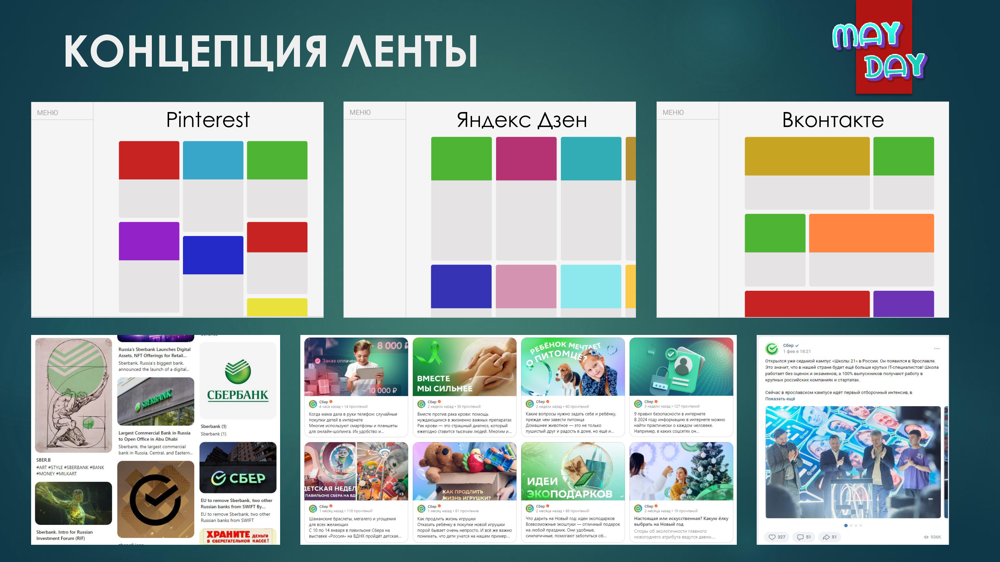
##
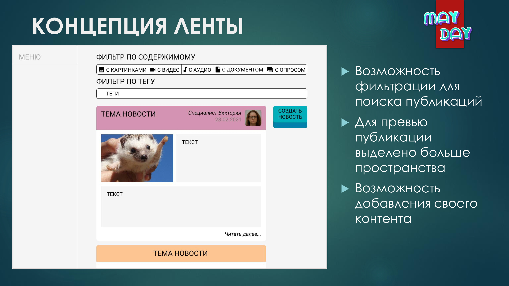
##
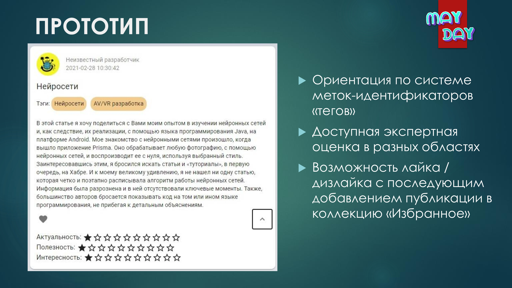
##
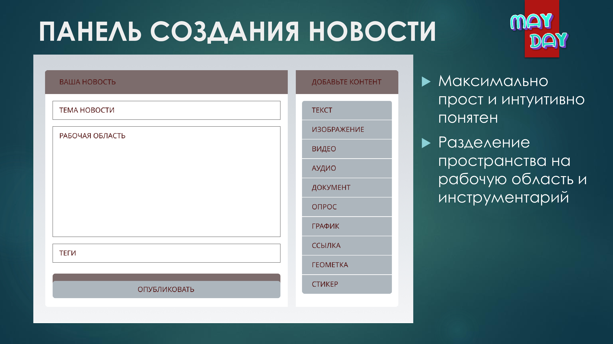
##
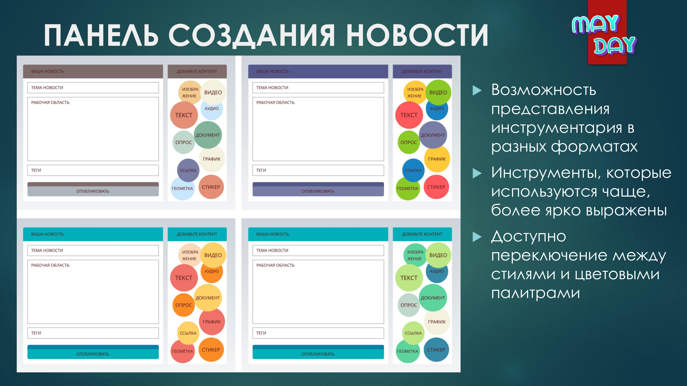
##
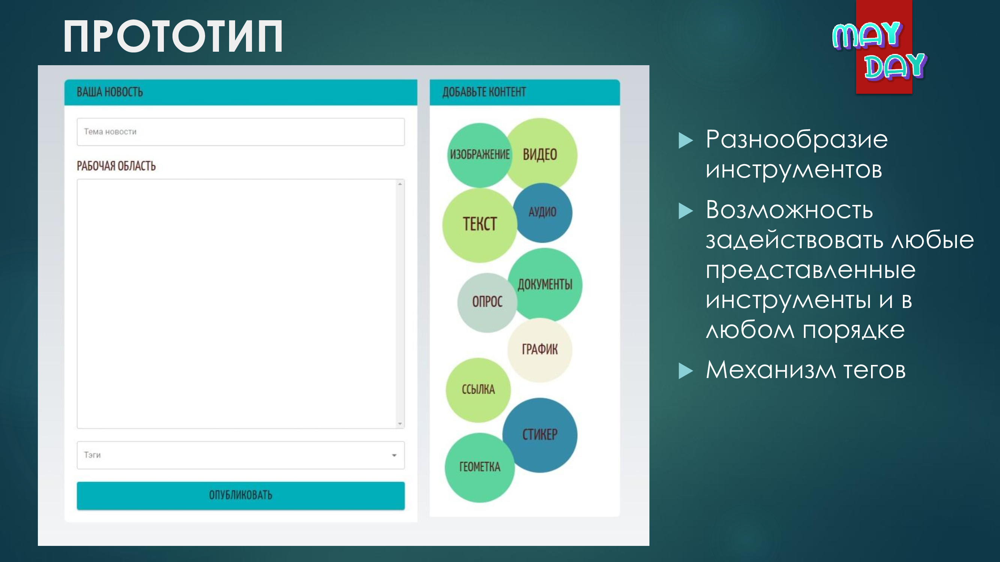
##
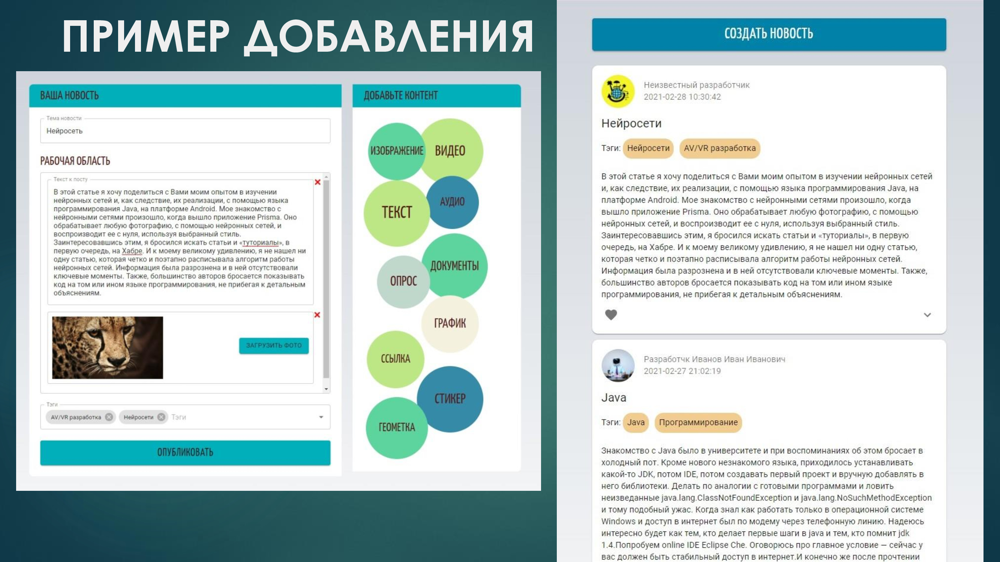
##
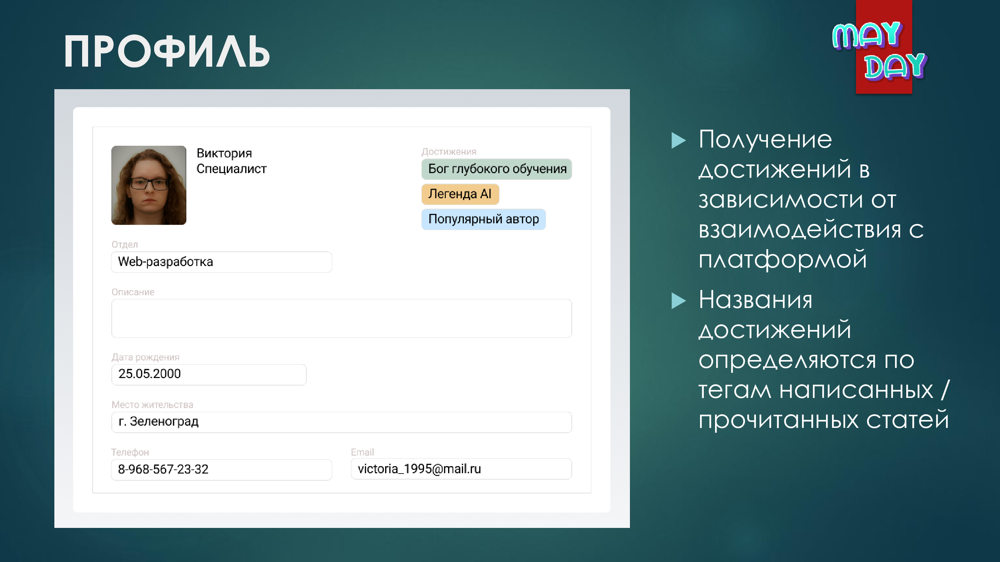
##
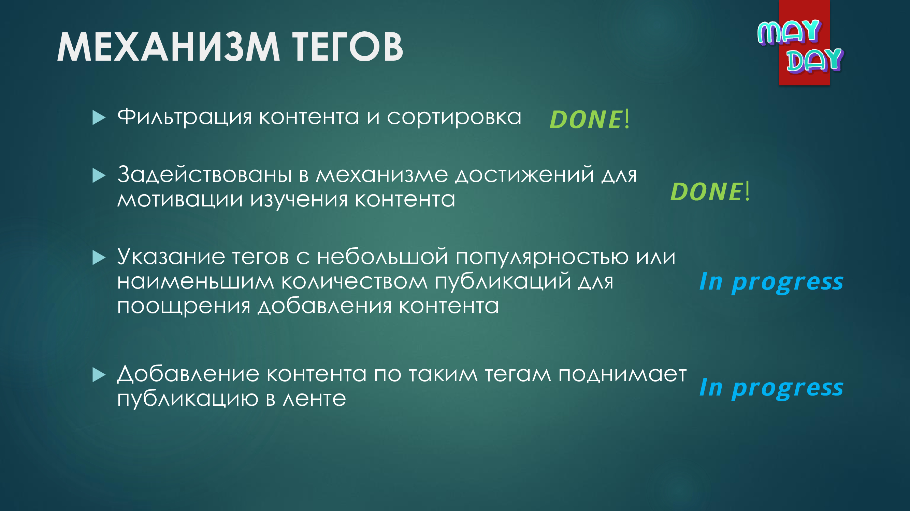
##
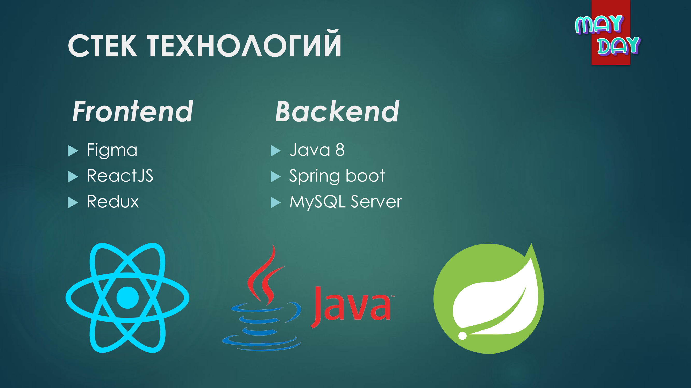
